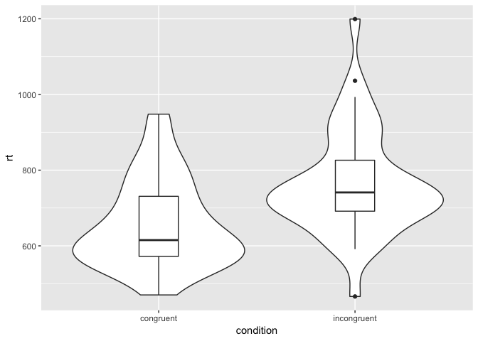
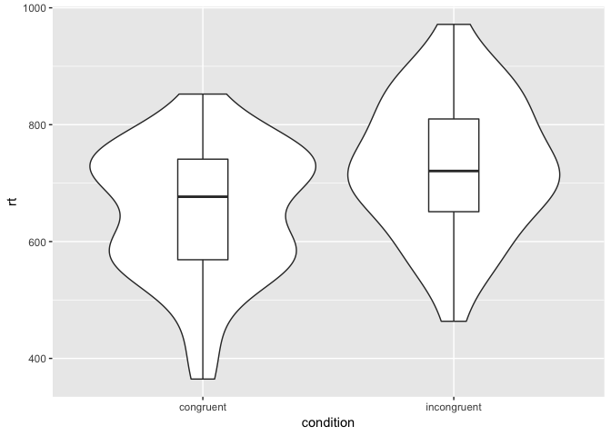
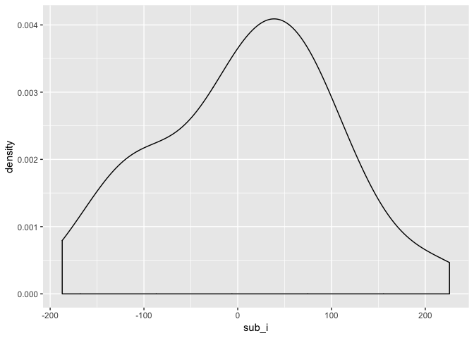
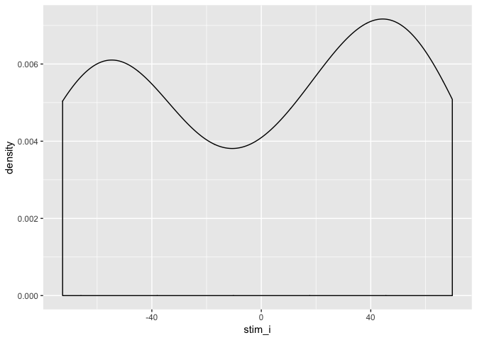
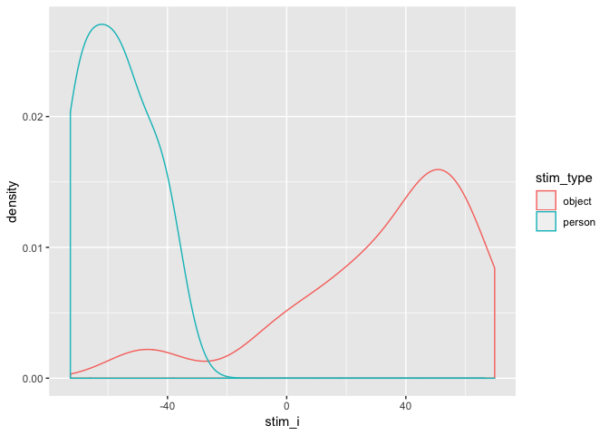

Understanding mixed effects models through simulating data
================
Lisa M. DeBruine & Dale J. Barr

Abstract
--------

Experimental designs that sample both subjects and stimuli from a larger population need to account for random effects of both subjects and stimuli using mixed effects models. However, much of this research is analyzed using ANOVA on aggregated responses because researchers are not confident specifying and interpreting mixed effects models. The tutorial will explain how to simulate data with random effects structure and analyse the data using linear mixed effects regression (with the lme4 R package). The focus will be on interpreting the LMER output in light of the simulated parameters and comparing the results to by-items and by-subjects ANOVA.

### Prerequisite knowledge or skills

-   Basic familiarity with experimental designs where subjects respond to stimuli
-   Basic familiarity with R

#### Who will benefit from this tutorial?

Researchers who use experimental designs that need to account for crossed random effects (e.g., designs that sample subjects and stimuli). For example, a large amount of experimental research in face perception or social cognition uses designs that would be better analysed using mixed effects models.

Model Study
-----------

In this tutorial we will simulate data from an [Implicit Association Task](https://implicit.harvard.edu/implicit/iatdetails.html). We will use open data from <https://osf.io/cv7iq/>

Simulating Data for Repeated Measures
-------------------------------------

``` r
library(tidyverse) # for data wrangling and visualisation
library(afex)      # for LMEM and ANOVA
library(faux)      # devtools::install_github("debruine/faux")
set.seed(8675309)  # this makes sure your script uses the same set of random numbers each time you run the full script 
                   # (never set this inside a function or loop)
```

### Load the data

We're going to use the `IATData` dataset from the IAT package. We have to do a bit of processing to filter and simplify this dataset. Don't worry about the code below.

``` r
stim_desc <- tribble(
  ~stim_id             , ~stim_type, ~stim_sex,
  "_bf_aliciakeys"     , "person", "female",
  "_bf_serenawilliams" , "person", "female",
  "_bm_neyo"           , "person", "male",  
  "_bm_nickcannon"     , "person", "male", 
  "_wf_jessicabiel"    , "person", "female",  
  "_wf_jessicasimpson" , "person", "female",
  "_wm_mattdamon"      , "person", "male", 
  "_wm_nicklachey"     , "person", "male", 
  "Count"              , "object", "male", 
  "Decimal"            , "object", "male",
  "Divide"             , "object", "male",
  "Essay"              , "object", "female",
  "Fraction"           , "object", "male",
  "Literature"         , "object", "female",
  "Math"               , "object", "male",
  "Multiply"           , "object", "male",
  "Number"             , "object", "male",
  "Paragraph"          , "object", "female",
  "Poetry"             , "object", "female",
  "Sentence"           , "object", "female",
  "Spelling"           , "object", "female",
  "Vocabulary"         , "object", "female"
)

iat_data <- IAT::IATData %>%
  filter(TRIAL_ERROR == 0, ATTEMPT == 1) %>%
  filter(BLOCK_PAIRING_DEFINITION_S %in% c("Math/Male,Language Arts/Female", "Language Arts/Male,Math/Female")) %>%
  mutate(
    condition = recode(
      BLOCK_PAIRING_DEFINITION_S, 
      "Math/Male,Language Arts/Female" = "congruent",
      "Language Arts/Male,Math/Female" = "incongruent"
    ),
    TRIAL_NAME_S = gsub("(fpi|\\.jpg)", "", TRIAL_NAME_S)
  ) %>%
  select(
    sub_id = SESSION_ID,
    stim_id = TRIAL_NAME_S,
    condition,
    rt = TRIAL_LATENCY
  ) %>%
  left_join(stim_desc, by = "stim_id") %>%
  mutate(
    condition.e = recode(condition, "incongruent" = 0.5, "congruent" = -0.5),
    stim_sex.e = recode(stim_sex, "male" = 0.5, "female" = -0.5),
    stim_type.e = recode(stim_type, "object" = 0.5, "person" = -0.5)
  ) %>%
  filter(rt > mean(rt) - 2*sd(rt),
         rt < mean(rt) + 2*sd(rt))
```

The data are now structured like this.

|  sub\_id| stim\_id             | condition |   rt| stim\_type | stim\_sex |  condition.e|  stim\_sex.e|  stim\_type.e|
|--------:|:---------------------|:----------|----:|:-----------|:----------|------------:|------------:|-------------:|
|   604660| Divide               | congruent |  715| object     | male      |         -0.5|          0.5|           0.5|
|   604660| \_bf\_serenawilliams | congruent |  497| person     | female    |         -0.5|         -0.5|          -0.5|
|   604660| Count                | congruent |  772| object     | male      |         -0.5|          0.5|           0.5|
|   604660| \_bf\_aliciakeys     | congruent |  507| person     | female    |         -0.5|         -0.5|          -0.5|
|   604660| Literature           | congruent |  501| object     | female    |         -0.5|         -0.5|           0.5|
|   604660| \_wm\_nicklachey     | congruent |  481| person     | male      |         -0.5|          0.5|          -0.5|

### Aggregate the data

We'll aggregate the data by subject.

``` r
agg_data <- iat_data %>%
  group_by(sub_id, condition) %>%
  summarise(rt = mean(rt)) %>%
  ungroup() %>%
  spread(condition, rt)
```

Also, make a long version for data visualisation and LMEM.

``` r
agg_data_long <- agg_data %>%
  gather(condition, rt, incongruent, congruent) %>%
  mutate(condition.e = recode(condition, "incongruent" = 0.5, "congruent" = -0.5))
```

### Graph the pilot data

``` r
agg_data_long %>%
  ggplot(aes(condition, rt)) +
  geom_violin() +
  geom_boxplot(width = 0.2)
```



### Calculate the parameters

``` r
sub_n <- nrow(agg_data)
m1 <- mean(agg_data$incongruent)
m2 <- mean(agg_data$congruent)
sd1 <- sd(agg_data$incongruent)
sd2 <- sd(agg_data$congruent)
r <- cor(agg_data$incongruent, agg_data$congruent)
```

| var         |  congruent|  incongruent|      mean|        sd|
|:------------|----------:|------------:|---------:|---------:|
| congruent   |    1.00000|      0.63641|  658.4923|  116.3721|
| incongruent |    0.63641|      1.00000|  763.8018|  138.0253|

### Simulate the data

``` r
sim_dat <- faux::rnorm_multi(
  n = sub_n,
  vars = 2,
  cors = r,
  mu = c(m1, m2),
  sd = c(sd1, sd2),
  varnames = c("incongruent", "congruent")
)
```

| var         |  incongruent|  congruent|    mean|      sd|
|:------------|------------:|----------:|-------:|-------:|
| incongruent |         1.00|       0.58|  728.52|  115.67|
| congruent   |         0.58|       1.00|  650.45|  111.76|

### Graph the simulated data

``` r
sim_dat %>%
  mutate(sub_id = 1:nrow(.)) %>%
  gather(condition, rt, incongruent, congruent) %>%
  ggplot(aes(condition, rt)) +
  geom_violin() +
  geom_boxplot(width = 0.2)
```



### Analyse the data with t-test

``` r
t.test(agg_data$incongruent, agg_data$congruent, paired = TRUE)
```

    ## 
    ##  Paired t-test
    ## 
    ## data:  agg_data$incongruent and agg_data$congruent
    ## t = 6.0426, df = 39, p-value = 4.519e-07
    ## alternative hypothesis: true difference in means is not equal to 0
    ## 95 percent confidence interval:
    ##   70.05847 140.56053
    ## sample estimates:
    ## mean of the differences 
    ##                105.3095

### Analyse the data with ANOVA

``` r
afex::aov_4(rt ~ (condition | sub_id), data = agg_data_long) %>%
  summary()
```

    ## 
    ## Univariate Type III Repeated-Measures ANOVA Assuming Sphericity
    ## 
    ##               Sum Sq num Df Error SS den Df  F value    Pr(>F)    
    ## (Intercept) 40458412      1  1034236     39 1525.646 < 2.2e-16 ***
    ## condition     221802      1   236908     39   36.513 4.519e-07 ***
    ## ---
    ## Signif. codes:  0 '***' 0.001 '**' 0.01 '*' 0.05 '.' 0.1 ' ' 1

### Analyse the data with LMEM

``` r
mod <- lmer(rt ~ condition.e + (1 | sub_id), 
            data = agg_data_long)

summary(mod)
```

    ## Linear mixed model fit by REML. t-tests use Satterthwaite's method [
    ## lmerModLmerTest]
    ## Formula: rt ~ condition.e + (1 | sub_id)
    ##    Data: agg_data_long
    ## 
    ## REML criterion at convergence: 965.7
    ## 
    ## Scaled residuals: 
    ##      Min       1Q   Median       3Q      Max 
    ## -2.10261 -0.58035  0.05163  0.46317  2.06904 
    ## 
    ## Random effects:
    ##  Groups   Name        Variance Std.Dev.
    ##  sub_id   (Intercept) 10222    101.10  
    ##  Residual              6075     77.94  
    ## Number of obs: 80, groups:  sub_id, 40
    ## 
    ## Fixed effects:
    ##             Estimate Std. Error     df t value Pr(>|t|)    
    ## (Intercept)   711.15      18.21  39.00  39.060  < 2e-16 ***
    ## condition.e   105.31      17.43  39.00   6.043 4.52e-07 ***
    ## ---
    ## Signif. codes:  0 '***' 0.001 '**' 0.01 '*' 0.05 '.' 0.1 ' ' 1
    ## 
    ## Correlation of Fixed Effects:
    ##             (Intr)
    ## condition.e 0.000

LMEM
----

Mixed effect model with random effects for stimuli

``` r
pilot_mod <- lmer(rt ~ condition.e +
              (1 + condition.e | sub_id) + 
              (1 | stim_id), 
            data = iat_data)

summary(pilot_mod)
```

    ## Linear mixed model fit by REML. t-tests use Satterthwaite's method [
    ## lmerModLmerTest]
    ## Formula: rt ~ condition.e + (1 + condition.e | sub_id) + (1 | stim_id)
    ##    Data: iat_data
    ## 
    ## REML criterion at convergence: 39227.9
    ## 
    ## Scaled residuals: 
    ##     Min      1Q  Median      3Q     Max 
    ## -3.3775 -0.5903 -0.1991  0.2998  5.2763 
    ## 
    ## Random effects:
    ##  Groups   Name        Variance Std.Dev. Corr
    ##  sub_id   (Intercept) 12488    111.75       
    ##           condition.e  9425     97.08   0.23
    ##  stim_id  (Intercept)  2969     54.49       
    ##  Residual             43698    209.04       
    ## Number of obs: 2885, groups:  sub_id, 40; stim_id, 22
    ## 
    ## Fixed effects:
    ##             Estimate Std. Error     df t value Pr(>|t|)    
    ## (Intercept)   724.26      21.54  56.02  33.624  < 2e-16 ***
    ## condition.e   104.25      17.24  38.02   6.047 4.89e-07 ***
    ## ---
    ## Signif. codes:  0 '***' 0.001 '**' 0.01 '*' 0.05 '.' 0.1 ' ' 1
    ## 
    ## Correlation of Fixed Effects:
    ##             (Intr)
    ## condition.e 0.169

### Get parameters from LMEM

``` r
grand_i <- fixef(pilot_mod)[["(Intercept)"]]

effect <- grand_i <- fixef(pilot_mod)[["condition.e"]]

sub_sd <- VarCorr(pilot_mod) %>% 
  as.data.frame() %>%
  filter(grp == "sub_id", var1 == "(Intercept)", is.na(var2)) %>% 
  pull(sdcor)

err_sd <- VarCorr(pilot_mod) %>% 
  as.data.frame() %>%
  filter(grp == "Residual") %>% 
  pull(sdcor)

sub <- tibble(
  sub_id = 1:sub_n,
  sub_i = rnorm(sub_n, 0, sub_sd)
)
              

stim <- ranef(pilot_mod)$stim_id %>%
  as_tibble(rownames = 'stim_id') %>%
  rename(stim_i = `(Intercept)`) %>%
  left_join(stim_desc, by = "stim_id")
```

### Graph the subject intercepts

``` r
ggplot(sub, aes(sub_i)) +
  geom_density()
```



### Graph the stimulus intercepts

``` r
ggplot(stim, aes(stim_i)) +
  geom_density()
```



Hmm, that looks bimodal.

``` r
ggplot(stim, aes(stim_i, color = stim_type)) +
  geom_density()
```



### Simulate data

``` r
sim_dat_lmem <- expand.grid(
  sub_id = sub$sub_id,
  stim_id = stim$stim_id,
  condition = c("congruent", "incongruent")
) %>%
  left_join(sub, by = "sub_id") %>%
  left_join(stim, by = "stim_id") %>%
  mutate(
    condition.e = recode(condition, "incongruent" = 0.5, "congruent" = -0.5),
    stim_sex.e = recode(stim_sex, "male" = 0.5, "female" = -0.5),
    stim_type.e = recode(stim_type, "object" = 0.5, "person" = -0.5),
    error = rnorm(nrow(.), 0, err_sd),
    eff = effect * condition.e,
    rt = grand_i + sub_i + stim_i + eff + error
  )
```

    ## Warning: Column `stim_id` joining factor and character vector, coercing
    ## into character vector

``` r
sim_mod <- lmer(rt ~ condition.e +
              (1 + condition.e | sub_id) + 
              (1 | stim_id), 
            data = sim_dat_lmem)
```

    ## boundary (singular) fit: see ?isSingular

``` r
summary(sim_mod)
```

    ## Linear mixed model fit by REML. t-tests use Satterthwaite's method [
    ## lmerModLmerTest]
    ## Formula: rt ~ condition.e + (1 + condition.e | sub_id) + (1 | stim_id)
    ##    Data: sim_dat_lmem
    ## 
    ## REML criterion at convergence: 24039.1
    ## 
    ## Scaled residuals: 
    ##     Min      1Q  Median      3Q     Max 
    ## -3.6275 -0.6802 -0.0059  0.6670  3.4623 
    ## 
    ## Random effects:
    ##  Groups   Name        Variance  Std.Dev. Corr 
    ##  sub_id   (Intercept)  8513.140  92.267       
    ##           condition.e     4.346   2.085  -1.00
    ##  stim_id  (Intercept)  2570.017  50.695       
    ##  Residual             47089.956 217.002       
    ## Number of obs: 1760, groups:  sub_id, 40; stim_id, 22
    ## 
    ## Fixed effects:
    ##             Estimate Std. Error      df t value Pr(>|t|)    
    ## (Intercept)   114.05      18.88   51.76   6.041 1.68e-07 ***
    ## condition.e   117.48      10.35 1551.73  11.350  < 2e-16 ***
    ## ---
    ## Signif. codes:  0 '***' 0.001 '**' 0.01 '*' 0.05 '.' 0.1 ' ' 1
    ## 
    ## Correlation of Fixed Effects:
    ##             (Intr)
    ## condition.e -0.025
    ## convergence code: 0
    ## boundary (singular) fit: see ?isSingular
