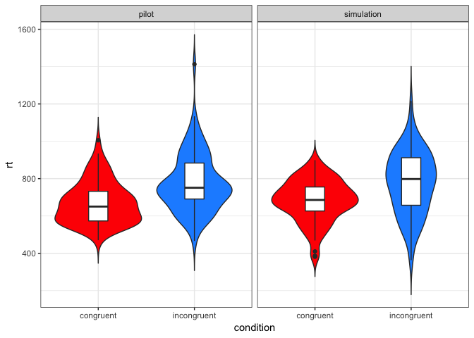

Understanding mixed effects models through simulating data
================
Lisa M. DeBruine & Dale J. Barr

Abstract
--------

Experimental designs that sample both subjects and stimuli from a larger population need to account for random effects of both subjects and stimuli using mixed effects models. However, much of this research is analyzed using ANOVA on aggregated responses because researchers are not confident specifying and interpreting mixed effects models. The tutorial will explain how to simulate data with random effects structure and analyse the data using linear mixed effects regression (with the lme4 R package). The focus will be on interpreting the LMER output in light of the simulated parameters and comparing the results to by-items and by-subjects ANOVA.

### Prerequisite knowledge or skills

-   Basic familiarity with experimental designs where subjects respond to stimuli
-   Basic familiarity with R

#### Who will benefit from this tutorial?

Researchers who use experimental designs that need to account for crossed random effects (e.g., designs that sample subjects and stimuli). For example, a large amount of experimental research in face perception or social cognition uses designs that would be better analysed using mixed effects models.

Model Study
-----------

In this tutorial we will simulate data from an [Implicit Association Task](https://implicit.harvard.edu/implicit/iatdetails.html).

Simulating Data for Repeated Measures
-------------------------------------

``` r
library(tidyverse) # for data wrangling and visualisation
library(afex)      # for LMEM and ANOVA
library(faux)      # devtools::install_github("debruine/faux")
set.seed(8675309)  # this makes sure your script uses the same set of random numbers each time you run the full script 
                   # (never set this inside a function or loop)
```

### Load the data

We're going to use the `IATData` dataset from the IAT package. We have to do a bit of processing to filter, simplify, and recode this dataset; the code for that is at [github](https://github.com/debruine/sim_mem/blob/master/R/data_prep.R), but you can get the dataset using the code below.

``` r
iat_data <- readr::read_csv("iat_data.csv")
#iat_data <- readr::read_csv("https://raw.githubusercontent.com/debruine/sim_mem/master/iat_data.csv")
```

The dataset has the following columns:

-   `sub_id`: The subject ID
-   `stim_id`: The name of the stimulus
-   `condition`: Whether the trial was *congruent* or *incongruent*
-   `rt`: Trial latency
-   `stim_type`: Whether the stimulus is a *word* or a *face*
-   `stim_sex`: Whether the stimulus is stereotyped as *male* or *female*

### Aggregate the data

First, we'll aggregate the data by subject and condition to calculate mean reaction times. This will create a table of 80 rows with columns `sub_id`, `condition`, and `rt`.

``` r
agg_data <- iat_data %>%
  group_by(sub_id, condition) %>%
  summarise(rt = mean(rt)) %>%
  ungroup()
```

### Graph the pilot data

``` r
agg_data %>%
  ggplot(aes(condition, rt, fill = condition)) +
  geom_violin(trim = FALSE, show.legend = FALSE) +
  geom_boxplot(fill = "white", width = 0.2, show.legend = FALSE) +
  ylim(0, 1500) +
  scale_fill_manual(values = c("red", "dodgerblue"))
```


### Calculate the parameters

First we put the data into wide format so there is one column for each cell.

``` r
vars <- agg_data %>%
  unite(var, condition) %>%
  spread(var, rt) %>%
  select(-sub_id)
```

The calculate the means and standard deviations for each cell, as well as the correlation matrix.

``` r
sub_n <- nrow(vars)
m1 <- mean(vars$congruent)
m2 <- mean(vars$incongruent)
sd1 <- sd(vars$congruent)
sd2 <- sd(vars$incongruent)
r <- cor(vars$congruent, vars$incongruent)
```

| var         |  congruent|  incongruent|    mean|      sd|
|:------------|----------:|------------:|-------:|-------:|
| congruent   |       1.00|         0.64|  658.49|  116.37|
| incongruent |       0.64|         1.00|  763.80|  138.03|

### Simulate the data

You can use the `rnorm_multi()` function from faux to simulate within-subject variables with specified means, SDs and correlations.

``` r
sim_vars <- faux::rnorm_multi(
  n = sub_n,
  vars = 2,
  cors = r,
  mu = c(m1, m2),
  sd = c(sd1, sd2),
  varnames = c("congruent", "incongruent")
)
```

| var         |  congruent|  incongruent|    mean|      sd|
|:------------|----------:|------------:|-------:|-------:|
| congruent   |       1.00|         0.54|  690.46|   97.73|
| incongruent |       0.54|         1.00|  780.75|  127.75|

You can do this more quickly using the `simdf()` function in faux.

``` r
sim_vars <- faux::simdf(vars, n = sub_n)
faux::check_sim_stats(sim_vars, usekable = TRUE)
```

| var         |  congruent|  incongruent|    mean|     sd|
|:------------|----------:|------------:|-------:|------:|
| congruent   |        1.0|          0.6|  669.16|   99.7|
| incongruent |        0.6|          1.0|  774.85|  120.1|

Add a subject ID and put the data back into long format.

``` r
sim_data <- sim_vars %>%
  mutate(sub_id = 1:sub_n) %>%
  gather(condition, rt, congruent:incongruent)
```

### Graph the simulated data

``` r
bind_rows(
  mutate(agg_data, type = "pilot"),
  mutate(sim_data, type = "simulation")
) %>%
  ggplot(aes(condition, rt, fill = condition)) +
  facet_grid(~type) +
  geom_violin(trim = FALSE, show.legend = FALSE) +
  geom_boxplot(fill = "white", width = 0.2, show.legend = FALSE) +
  ylim(0, 1500) +
  scale_fill_manual(values = c("red", "dodgerblue"))
```



Analysis
--------

### T-test

``` r
ttest <- t.test(rt~condition, agg_data, paired = TRUE)
ttest
```

    ## 
    ##  Paired t-test
    ## 
    ## data:  rt by condition
    ## t = -6.0426, df = 39, p-value = 4.519e-07
    ## alternative hypothesis: true difference in means is not equal to 0
    ## 95 percent confidence interval:
    ##  -140.56053  -70.05847
    ## sample estimates:
    ## mean of the differences 
    ##               -105.3095

### ANOVA

See how the ANOVA compares to the t-test. The F-value is the square of the t-value, and the p-values are identical.

``` r
anova <- afex::aov_ez(id = "sub_id", 
             dv = "rt", 
             within = "condition", 
             data = agg_data)
summary(anova)
```

    ## 
    ## Univariate Type III Repeated-Measures ANOVA Assuming Sphericity
    ## 
    ##               Sum Sq num Df Error SS den Df  F value    Pr(>F)    
    ## (Intercept) 40458412      1  1034236     39 1525.646 < 2.2e-16 ***
    ## condition     221802      1   236908     39   36.513 4.519e-07 ***
    ## ---
    ## Signif. codes:  0 '***' 0.001 '**' 0.01 '*' 0.05 '.' 0.1 ' ' 1

### LMEM

### Terminology (derived from broom\_mixed)

-   *terms*: the categorical or continuous predictor variables that control the expected value (i.e., enter into the linear predictor for some part of the model)
-   *fixed effects*: the parameters that describe the population-level effects of (categorical and continuous) predictor variables
-   *random-effect parameters*: the upper-level parameters that describe the distribution of random variables (variance, covariance, precision, standard deviation, or correlation)
-   *random-effect values*: the values that describe the deviation of the observations in a group level from the population-level effect
-   *grouping variable*: the categorical variable (factor) that identifies which group or cluster an observation belongs to
-   *group level* the particular level of a factor that specifies which level of the grouping variable an observation belongs to

We need to *effect code* condition to match the behaviour of ANOVA. We set the congruent condition to -0.5 and the incongruent condition to +0.5 because we predict lower reaction times for the congruent condition.

A mixed effects model is specified in this format: `dv ~ iv + (1 | id)`, where `dv` is the value to be predicted, `iv` is the predictor variables (*terms*), and `id` is the grouping variable that defines your groups (here, our only group is subjects).

``` r
agg_data$condition.e <- recode(agg_data$condition, 
                               "congruent" = -0.5, 
                               "incongruent" = 0.5)

lmem <- lmer(rt ~ condition.e + (1 | sub_id), data = agg_data)
summary(lmem)
```

Linear mixed model fit by REML. t-tests use Satterthwaite's method \[ lmerModLmerTest\] Formula: rt ~ condition.e + (1 | sub\_id) Data: agg\_data

REML criterion at convergence: 965.7

Scaled residuals: Min 1Q Median 3Q Max -2.10261 -0.58035 0.05163 0.46317 2.06904

Random effects: Groups Name Variance Std.Dev. sub\_id (Intercept) 10222 101.10
Residual 6075 77.94
Number of obs: 80, groups: sub\_id, 40

Fixed effects: Estimate Std. Error df t value Pr(&gt;|t|)
(Intercept) 711.15 18.21 39.00 39.060 &lt; 2e-16 *** condition.e 105.31 17.43 39.00 6.043 4.52e-07 *** --- Signif. codes: 0 '***' 0.001 '**' 0.01 '*' 0.05 '.' 0.1 ' ' 1

Correlation of Fixed Effects: (Intr) condition.e 0.000

First we'll focus on the fixed effects. Note how the t-values and p-values correspond to the t-test and ANOVA. Also note how the estimate for the effect of condition corresponds to the mean difference calculated in the t-test. The estimate for the intercept corresponds to the overall mean reaction time.

Now we can look at the random effects. You can calculate the proportion of total variance explained by subject-specific intercepts as subject variance divided by total variance. This value is approximately equal to the correlation between the congruent and incongruent conditions.

Simulating Data for LMEM
------------------------

The data simulation process for a mixed effect model uses the random effect variance and the fixed effect estimates. The code below will get these values from the model we just ran.

### Get parameters from LMEM

``` r
fixed_effects <- fixef(lmem)
random_effects <- VarCorr(lmem) %>% as.data.frame()

grand_i <- fixed_effects[["(Intercept)"]]

effect <- fixed_effects[["condition.e"]]

sub_sd <- random_effects %>%
  filter(grp == "sub_id", 
         var1 == "(Intercept)", 
         is.na(var2)) %>% 
  pull(sdcor)

err_sd <- random_effects %>%
  filter(grp == "Residual") %>% 
  pull(sdcor)
```

Simulate 100 new subjects who have random intercepts with the same standard deviation as the subjects in your pilot data.

``` r
sub_n <- 100

sub <- tibble(
  sub_id = 1:sub_n,
  sub_i = rnorm(sub_n, 0, sub_sd)
)
```

Create a data table of each trial by crossing the subject IDs with each within-subject condition using `expand.grid()`. This function creates every possible combination of the factors you specify.

``` r
trials <- expand.grid(
  sub_id = sub$sub_id,
  condition = c("congruent", "incongruent")
)
```

Simulate your data by starting with the trial table, joining in the `sub` table to include each subject's random intercept, effect-coding condition, calculating the error term using the random effects standard deviation for the residual defined above, calculating the effect of condition by multiplying the effect size (the estimate for condition defined above) by the effect-coded condition, and calculating the reaction time by adding together the grand intercept (defined above by the intercept fixed effect estimate), the subject-specific intercept, the effect of condition, and the error term.

``` r
sim_data <- trials %>%
  left_join(sub, by = "sub_id") %>%
  mutate(
    condition.e = recode(condition, "incongruent" = 0.5, "congruent" = -0.5),
    error = rnorm(nrow(.), 0, err_sd),
    cond_eff = effect * condition.e,
    rt = grand_i + sub_i + cond_eff + error
  )
```

Run a mixed-effect model on your simulated data.

``` r
sim_mod <- lmer(rt ~ condition.e + (1 | sub_id), data = sim_data)

summary(sim_mod)
```

    ## Linear mixed model fit by REML. t-tests use Satterthwaite's method [
    ## lmerModLmerTest]
    ## Formula: rt ~ condition.e + (1 | sub_id)
    ##    Data: sim_data
    ## 
    ## REML criterion at convergence: 2455.7
    ## 
    ## Scaled residuals: 
    ##      Min       1Q   Median       3Q      Max 
    ## -2.91692 -0.42061 -0.00205  0.46846  2.30053 
    ## 
    ## Random effects:
    ##  Groups   Name        Variance Std.Dev.
    ##  sub_id   (Intercept) 12617    112.33  
    ##  Residual              5936     77.05  
    ## Number of obs: 200, groups:  sub_id, 100
    ## 
    ## Fixed effects:
    ##             Estimate Std. Error     df t value Pr(>|t|)    
    ## (Intercept)   700.81      12.48  99.00  56.135  < 2e-16 ***
    ## condition.e    98.55      10.90  99.00   9.045 1.33e-14 ***
    ## ---
    ## Signif. codes:  0 '***' 0.001 '**' 0.01 '*' 0.05 '.' 0.1 ' ' 1
    ## 
    ## Correlation of Fixed Effects:
    ##             (Intr)
    ## condition.e 0.000

Stop Ignoring Trials
--------------------

``` r
iat_data$condition.e <- recode(iat_data$condition, 
                               "congruent" = -0.5, 
                               "incongruent" = 0.5)

pilot_mod <- lmer(rt ~ condition.e +
              (1 + condition.e | sub_id) + 
              (1 | stim_id), 
            data = iat_data)

summary(pilot_mod)
```

    ## Linear mixed model fit by REML. t-tests use Satterthwaite's method [
    ## lmerModLmerTest]
    ## Formula: rt ~ condition.e + (1 + condition.e | sub_id) + (1 | stim_id)
    ##    Data: iat_data
    ## 
    ## REML criterion at convergence: 39227.9
    ## 
    ## Scaled residuals: 
    ##     Min      1Q  Median      3Q     Max 
    ## -3.3775 -0.5903 -0.1991  0.2998  5.2763 
    ## 
    ## Random effects:
    ##  Groups   Name        Variance Std.Dev. Corr
    ##  sub_id   (Intercept) 12488    111.75       
    ##           condition.e  9425     97.08   0.23
    ##  stim_id  (Intercept)  2969     54.49       
    ##  Residual             43698    209.04       
    ## Number of obs: 2885, groups:  sub_id, 40; stim_id, 22
    ## 
    ## Fixed effects:
    ##             Estimate Std. Error     df t value Pr(>|t|)    
    ## (Intercept)   724.26      21.54  56.02  33.624  < 2e-16 ***
    ## condition.e   104.25      17.24  38.02   6.047 4.89e-07 ***
    ## ---
    ## Signif. codes:  0 '***' 0.001 '**' 0.01 '*' 0.05 '.' 0.1 ' ' 1
    ## 
    ## Correlation of Fixed Effects:
    ##             (Intr)
    ## condition.e 0.169

### Get parameters from LMEM

``` r
fixed_effects <- fixef(pilot_mod)
random_effects <- VarCorr(pilot_mod) %>% as.data.frame()

grand_i <- fixed_effects[["(Intercept)"]]

effect <- fixed_effects[["condition.e"]]

sub_sd <- random_effects %>%
  filter(grp == "sub_id", 
         var1 == "(Intercept)", 
         is.na(var2)) %>% 
  pull(sdcor)

err_sd <- random_effects %>%
  filter(grp == "Residual") %>% 
  pull(sdcor)
```

Simulate 100 new subjects who have random intercepts with the same standard deviation as the subjects in your pilot data.

``` r
sub_n <- 100

sub <- tibble(
  sub_id = 1:sub_n,
  sub_i = rnorm(sub_n, 0, sub_sd)
)
```

### Get the stimuli

``` r
stim_desc <-  iat_data %>%
  group_by(stim_id, stim_type, stim_sex) %>%
  summarise()

stim <- ranef(pilot_mod)$stim_id %>%
  as_tibble(rownames = 'stim_id') %>%
  rename(stim_i = `(Intercept)`) %>%
  left_join(stim_desc, by = "stim_id")
```

### Graph the stimulus intercepts

``` r
ggplot(stim, aes(stim_i)) +
  geom_density()
```


Hmm, that looks bimodal.

``` r
ggplot(stim, aes(stim_i, color = stim_type)) +
  geom_density()
```


### Simulate data

``` r
sim_dat_lmem <- expand.grid(
  sub_id = sub$sub_id,
  stim_id = stim$stim_id,
  condition = c("congruent", "incongruent")
) %>%
  left_join(sub, by = "sub_id") %>%
  left_join(stim, by = "stim_id") %>%
  mutate(
    condition.e = recode(condition, "incongruent" = 0.5, "congruent" = -0.5),
    stim_sex.e = recode(stim_sex, "male" = 0.5, "female" = -0.5),
    stim_type.e = recode(stim_type, "word" = 0.5, "face" = -0.5),
    error = rnorm(nrow(.), 0, err_sd),
    eff = effect * condition.e,
    rt = grand_i + sub_i + stim_i + eff + error
  )
```

    ## Warning: Column `stim_id` joining factor and character vector, coercing
    ## into character vector

``` r
sim_mod <- lmer(rt ~ condition.e +
              (1 + condition.e | sub_id) + 
              (1 | stim_id), 
            data = sim_dat_lmem)

summary(sim_mod)
```

    ## Linear mixed model fit by REML. t-tests use Satterthwaite's method [
    ## lmerModLmerTest]
    ## Formula: rt ~ condition.e + (1 + condition.e | sub_id) + (1 | stim_id)
    ##    Data: sim_dat_lmem
    ## 
    ## REML criterion at convergence: 59997.2
    ## 
    ## Scaled residuals: 
    ##     Min      1Q  Median      3Q     Max 
    ## -3.9550 -0.6774  0.0045  0.6681  3.6020 
    ## 
    ## Random effects:
    ##  Groups   Name        Variance Std.Dev. Corr
    ##  sub_id   (Intercept) 19929.8  141.17       
    ##           condition.e   407.4   20.18   0.50
    ##  stim_id  (Intercept)  3028.3   55.03       
    ##  Residual             45173.9  212.54       
    ## Number of obs: 4400, groups:  sub_id, 100; stim_id, 22
    ## 
    ## Fixed effects:
    ##             Estimate Std. Error      df t value Pr(>|t|)    
    ## (Intercept)  731.636     18.634  81.165   39.26   <2e-16 ***
    ## condition.e  104.053      6.719  98.991   15.49   <2e-16 ***
    ## ---
    ## Signif. codes:  0 '***' 0.001 '**' 0.01 '*' 0.05 '.' 0.1 ' ' 1
    ## 
    ## Correlation of Fixed Effects:
    ##             (Intr)
    ## condition.e 0.113
